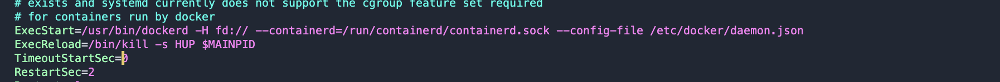

Docker Hub откличили в РФ туториал как обойти блокировку

# 1. Создаем конфиг файл в sudo vim /etc/docker/daemon.json

        1.1 sudo vim /etc/docker/daemon.json
        1.2 Нужно добавить прокси сервер один из

    https://mirror.gcr.io гугл
    https://daocloud.io китай
    https://c.163.com китай
    https://registry.docker-cn.com китай

# 2. Добавить путь до daemon.json в сервис докера

        ExecStart=/usr/bin/dockerd -H fd:// --containerd=/run/containerd/containerd.sock --config-file /etc/docker/daemon.json
        ExecReload=/bin/kill -s HUP $MAINPID

    sudo vim /lib/systemd/system/docker.service

## 3. Ребутим

И используем в таком виде

        mirror.gcr.io/library/node:19.9.0

    Так же можно проверить с помощью docker info

